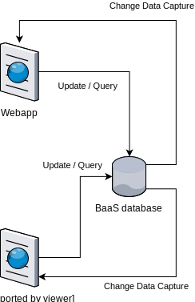
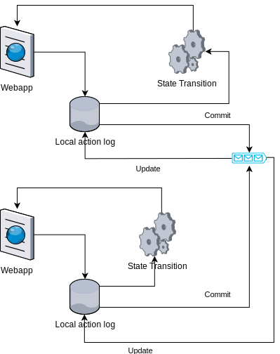

# Traditional BaaS vs Sync3k

## Traditional BaaS

Traditional BaaS provides NoSQL-like database interface that operates on the always-online basis. Webapp client directly operates on the backend database to update and query data.

In addition, BaaS provides a form of Change Data Capture binding to UI frameworks to offer real-time updates.

BaaS database serves as the primary source of truth. Any subsequent online and offline analyses are performed on the database or offline data dumps of the database. Therefore, the data model of the application itself is tied to the characteristics of the BaaS database of choice.

## Sync3k

In Sync3k applications, states are captured by deterministic state transitions. Applications can always arrive at the identical state by replaying the actions. Sync3k engine records all the actions in a local database before passing onto the state transition. In the background, Sync3k engine commits actions to the local totally-ordered queue. When the queue is updated, it notifies Sync3k engine, which "rebases" the current state, replay global actions, then replay the residual local actions on top of it.

